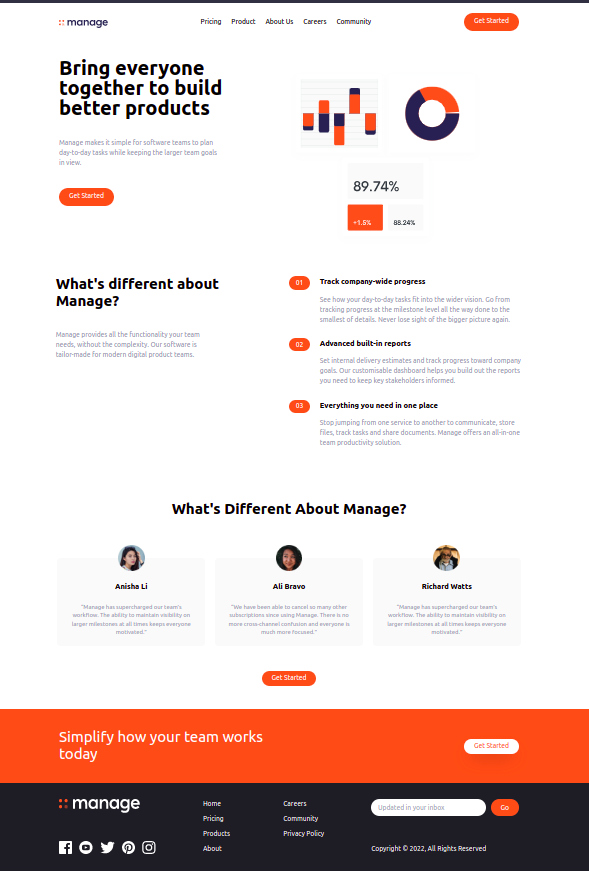

# _TAILWIND-CSS_

- A utility-first, low level CSS framework for rapidly building custom user interfaces. 

- highly customizable

- doesn’t impose design specification

- takes a ‘raw’ CSS file, processes this CSS file over a configuration file, and produces an output.

# Why Tailwind CSS?

- Faster UI building process

- It is a utility-first CSS framework 
    - can use utility classes to build custom designs without writing CSS as in traditional approach. 
 
# Advantages of Tailwind CSS:

- Minimum lines of Code in CSS file.

- Can customize the designs to make the components.

- Makes the website responsive.

- Can make local changes via Tailwind

# How tailwind is different from other CSS frameworks ?

- can easily make your own reusable components in tailwind

- gives lot more flexibility than bootstrap or any other frameworks 

- allows you to customize your designs in a more unique way

# _THE LANDING PAGE_

This is the landing page designed 

# _NOTES_

- [Setting up the project]()

# _REFERENCES_

- [Tailwind-CSS documentation](https://tailwindcss.com/)

- [Basics of HTML and CSS](https://www.youtube.com/playlist?list=PL4cUxeGkcC9ivBf_eKCPIAYXWzLlPAm6G)

- [Tailwind-CSS Tutorial by Traversy Media](https://www.youtube.com/watch?v=dFgzHOX84xQ&t=312s)

- [Tailwind-CSS Tutorial by Net-Ninja](https://www.youtube.com/playlist?list=PL4cUxeGkcC9gpXORlEHjc5bgnIi5HEGhw)

- [CSS Tutorial by w3schools.com](https://www.w3schools.com/css/default.asp)

- [Spacing in Tailwind-CSS](https://beyondco.de/blog/tailwind-css-spacing-explained)

- [justify-content in CSS](https://developer.mozilla.org/en-US/docs/Web/CSS/justify-content)